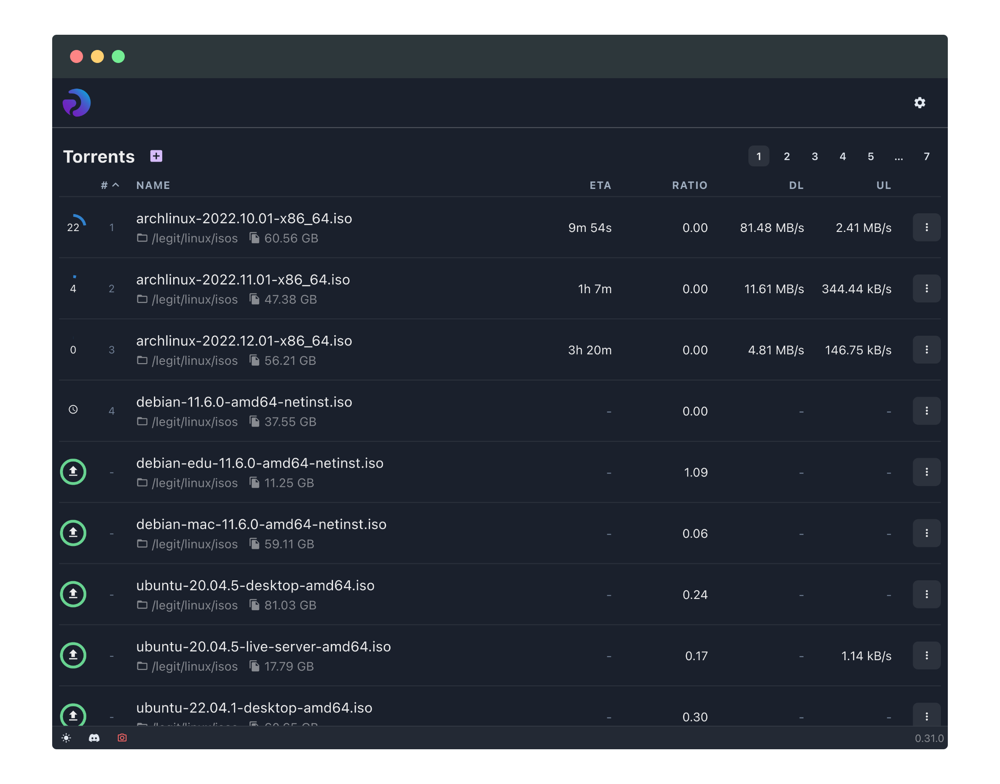

<h1 align="center">
  <br/>
  Porla
</h1>

<p align="center">
  <a href="https://discord.gg/FNVVRzqJAG">
    
  </a>
  
</p>

Porla is a powerful BitTorrent client with high performance and low memory
usage. It is designed for headless operations on servers and seedboxes and can
easily manage tens of thousands of torrents.

The focus of Porla is to provide a BitTorrent client that is _fast_, _correct_
and _extensible_.

<p align="center">
   <br/>
</p>

### Features

 * Based on libtorrent with support for both BitTorrent v1 and v2.
 * Lua API for writing [plugins and workflows](https://porla.org/plugins/getting_started).
 * Supports multiple, distinct sessions with different settings.
 * Embedded query language to find torrents. Fast.
 * [HTTP API](https://porla.org/api/auth) with JWT auth.
 * Modern web UI.

#### Plugins and workflows

The Lua API can be used to automate and integrate Porla with all types of
applications and services, such as Discord and [ntfy.sh](https://ntfy.sh).

#### Multiple sessions

You can easily set up multiple sessions to separate your public torrents from
your private torrents, for example. Each session binds to its own network
device and port pair, and can have custom rate limits, queueing rules, etc.

#### The Porla query language (PQL)

To make it easy to navigate and filter a large amount of torrents Porla has a
simple, embedded query language named PQL.

With PQL you can easily find torrents matching specific criterias.

## Getting started

Download the latest release and put it somewhere safe. Then, run it. By default,
Porla bind the web UI to `localhost:1337`. On first use you will be prompted to
set up a user account.

```shell
porla
```

To show all options available, suffix with `--help`.

```shell
porla --help
```

For example, you can run `porla` with an in-memory SQLite database by passing
`--db=:memory:`.

```shell
porla --db=:memory:
```

## Configuration

You can configure Porla in three ways - environment variables, command line
arguments, and a TOML config file.

Command line arguments have the highest priority, then the config file, and
lastly the environment variables. The app will, however, run without any applied
configuration and use sensible defaults instead.

### Environment variables and command line args

 * `PORLA_CONFIG_FILE` or `--config-file` - path to a TOML config file with
   additional configuration.
 * `PORLA_DB` or `--db` - path a file (which does not need to exist) that `porla`
   will use to store its state.
 * `PORLA_HTTP_AUTH_DISABLED_YES_REALLY` - set to `true` to disable HTTP JWT
   authentication (_not recommended_).
 * `PORLA_HTTP_BASE_PATH` or `--http-base-path` - set to a path where the HTTP parts
   of Porla will be served. Defaults to `/`.
 * `PORLA_HTTP_HOST` or `--http-host` - set to an IP address which to bind the HTTP
   server. Defaults to _127.0.0.1_.
 * `PORLA_HTTP_METRICS_ENABLED` or `--http-metrics-enabled` - set to true/false to
   enable or disable the metrics endpoint. Defaults to _true_.
 * `PORLA_HTTP_PORT` or `--http-port` - set to the port to use for the HTTP server.
   Defaults to _1337_.
 * `PORLA_LOG_LEVEL` or `--log-level` - the minimum log level to use. Valid values
   are _trace_, _debug_, _info_, _warning_, _error_, _fatal_. Defaults to _info_.
 * `PORLA_SESSION_SETTINGS_BASE` or `--session-settings-base` - the libtorrent
   settings base to use for session settings. Valid values are _default_,
   _min\_memory\_usage_, _high\_performance\_seed_. Defaults to _default_.
 * `PORLA_STATE_DIR` or `--state-dir` - a path to a directory where Porla will
   store its state.
 * `PORLA_TIMER_DHT_STATS` or `--timer-dht-stats` - the interval in milliseconds
   to push DHT stats. Defaults to _5000_.
 * `PORLA_TIMER_SESSION_STATS` or `--timer-session-stats` - the interval in
   milliseconds to push session stats. Defaults to _5000_.
 * `PORLA_TIMER_TORRENT_UPDATES` or `--timer-torrent-updates` - the interval in
   milliseconds to push torrent state updates. Defaults to _1000_.
 * `PORLA_WORKFLOW_DIR` or `--workflow-dir` - the path to where Porla will load
   user workflows from.

Refer to [the official documentation](https://porla.org/configuration/) for
information on how to set up the TOML configuration.

## Development

Various bits and pieces of information regarding development.

### Building

> [!NOTE]
> I (@vktr) run Arch on my desktop and macOS (Sequoia) which is why the build
> process might be skewed towards those targets.


#### Docker

The Dockerfile in Porla produces a statically linked binary and can be used to
build a Docker image. Copy the Porla binary from the Docker image if you do not
want to introduce a Docker dependency on your seedbox.

```sh
docker build -t porla-tmp .
docker create --name porla-tmp-bin porla-tmp
docker cp porla-tmp-bin:/usr/bin/porla .
docker rm -f porla-tmp-bin
```

#### Dependencies (on Arch)

 * antlr4-runtime (4.13.2)
 * boost (1.86)
 * libgit2 (1.8.4)
 * libtorrent-rasterbar (2.0.10)
 * libzip (1.11.2)
 * uriparser (0.9.8)

#### uWebSockets

uWebSockets is the outlier since it does not provide any packages. Building it
is easy, however.

```sh
git clone --recursive https://github.com/uNetworking/uWebSockets
WITH_ASIO=1 WITH_OPENSSL=1 make -C uWebSockets
sudo cp uWebSockets/uSockets/uSockets.a /usr/local/lib/libuSockets.a
sudo cp uWebSockets/uSockets/src/libusockets.h /usr/local/include
sudo cp uWebSockets/src/* /usr/local/include/uWebSockets
```

### Generating ANTLR4 grammar source files

This is only needed when `PorlaQueryLang.g4` is modified.

```shell
wget https://www.antlr.org/download/antlr-4.11.1-complete.jar
pushd src/query
java -jar ../../antlr-4.11.1-complete.jar -Dlanguage=Cpp -visitor -no-listener -o _aux PorlaQueryLang.g4
popd
```
